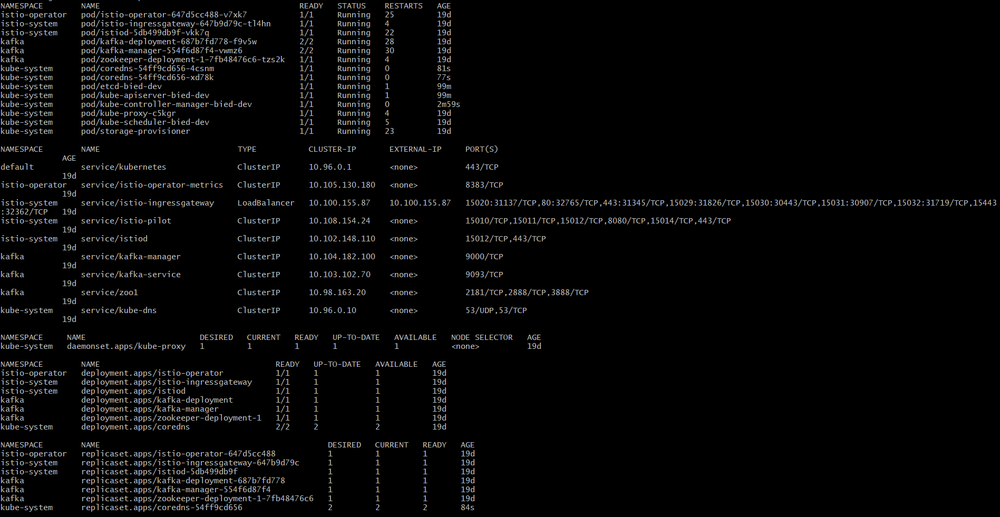
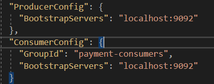
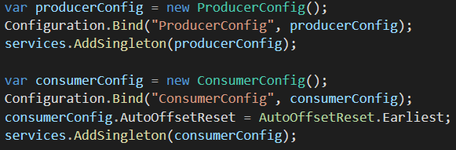
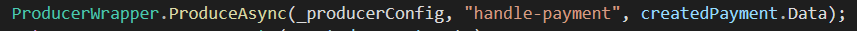
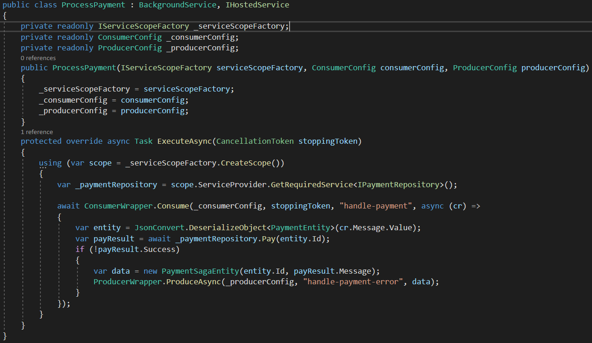
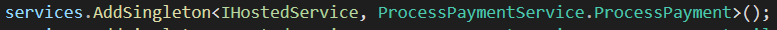

# Kafka Demo Project
This project is a demo project to locally test the workings of Kafka with .Net Core 3.3
Within the deployments folder are the yaml files needed to deploy kafka in your Kubernetes cluster.

This README will contain instructions on how to deploy it on a local Kubernetes cluster for local development.

## Deploy Kafka locally
1. First you have to start a kubernetes cluster.
2. Go to the root of this project with your CLI.
3. Use `helm install gateway deployments/gateway` to install the istio gateway.
4. Use: `helm install kafka deployments/kafka` to install kafka.
5. Use: `helm install kafka-manager deployments/kafka-manager` to install the kafka-manager.
   This is a UI manager were you get an overview of topics, brokers and more.
6. To see if all the pods have been deployed correctly run the following command: `kubectl get all --all-namespaces`.
   The result should look like the following picture:
   
7. If you use minikube you will need to open a tunnel in order to access the kafka-manager: `minikube tunnel`.
8. To go to the kafka-manager you can type in the external IP of the istio gateway service into a browser and login with the following credentials:  
   username: admin  
   password: admin  
9. Now to start local development you will need to port forward the kafka input port otherwise you cant access kafka: `kubectl -n kafka port-forward <DEPLOYMENT NAME> 9092:9092`.
10. Now run the project locally (don't recommend using IIS Express) and you can make GRPC calls to the backend trough: localhost:5000.

### Known issues
#### Coredns crash
If the core dns is crashed you can follow the next steps to fix it:
1. `kubectl rollout restart -n kube-system deployment/coredns` to restart it.
2. Then use `kubectl get all --all-namespaces`  to check if the coredns pods are restarted.
3. If the storage-provisioner also crashed but the coredns pods are running now. You can restart you machine to fix this.

## Implementation guide
This guide will give you information on how to implement Kafka into your own project.

First step is to download Confluent.Kafka and add Consumer and Producer configurations in the appsettings.json:

In the startup file you can add these configurations to a singleton Consumer and Producer Config class:

The localhost:9092 needs to be the Kafka access point within your cluster. For local development you can use localhost if you use the [instructions](#deploy-kafka-locally)

Within that demo project you can also find Producer- and Consumer wrappers that help to make the code cleaner. You can find them in the following folder: paymentApp/Common.

Now make a producer call to a certain topic using the producerWrapper:

For the consumer you need a BackgroundService to make it run in the background on a separate thread. This will make it continuously searching for new data on a certain topic:

You also need to make the class a singleton in the startup file:

### Useful links
- Transactions (useful for consuming in a microservice): https://www.confluent.io/blog/transactions-apache-kafka/ 
- Full Kafka with rollback explanation: https://medium.com/@sharmaNK/asynchronous-payment-7de952460845
- Kafka documentation: https://kafka.apache.org/documentation/ 

## Test Payment Application
The payment application contains two kafka events that will fire at two different topics: process payment and process payment failed. These run as a background service so they will always run and search for new topic data to process. The following 2 scenario's will each make use of these processes:

### Pay success
If you register two users into the database you can make a payment between these users. The payment process will receive this payment and tries to process it. In this scenario it should succeed.
1. Register two users and save their id's.
2. Use the two id's in the pay call one as receiver the other as sender:
   
3. You will receive a payment ticket as response if it is created correctly.
4. If you call the receive in the payment service with the senderId as userId you can check the status of the payment.

### Pay failure
To let the payment fail you need to do the same steps as the previous chapter but now you need to **fill in an incorrect receiverId**.

You will still receive a payment ticket but if you call the receive in the payment service you will see that the ticket has been deleted.